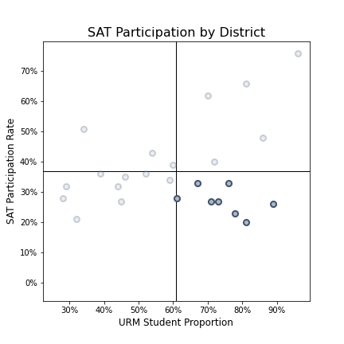
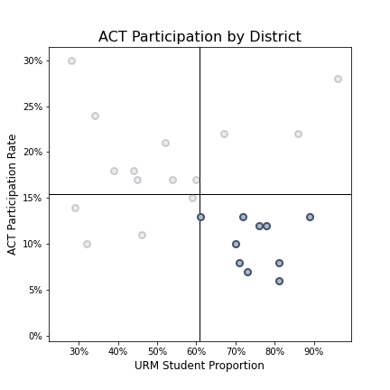

# Standardized Test Analysis
**Using SAT and ACT Participation Rates to Explore Underrepresentation at California Universities**
 By Christian Normand
  **Note:** I completed this project as part of a Data Science Immersive
program with General Assembly. The California Department of Education did not
commission this work, and any references to the department, school districts,
or other real-life entities exist solely to provide meaningful context for the
project.

## Problem Statement
The California Department of Education (DOE) seeks to address issues contributing to the underrepresentation of Latino, African American, and Native American students at state universities. This project supports the department's efforts by evaluating school districts based on the proportion of students belonging to these groups and the participation rate among high school seniors in college admissions tests. The outcome of this project is a list of school districts that would be a good starting point for the department's work.

## Background
The University of California Academic Senate published a report in January 2020 that explored whether the SAT and ACT should still be part of the college admissions process. The report identified a significant discrepancy between the racial and ethnic makeup of the state's high schoolers and that of current UC students. 59 percent of California's high school graduates in 2019 were either Latino, African American, or Native American. In contrast, students from these groups comprised only 37 percent or California resident students admitted to the UC system in 2019 [1]. Standardized testing is by no means the sole reason for this difference. However, the University of California system and California State University system both eliminated the SAT and ACT from their admissions requirements in 2020. It is clear that addressing underrepresentation and educational inequity is a priority for the state.

## Analysis
This project analyzes California's 25 largest school districts in terms of enrolled high school seniors in 2019. Analysis mainly focused on three metrics:
* The percentage of students in a district who belong to an underrepresented minority (URM) group (The UC Academic Senate Report defines URM as Latino, African American, or Native American students.)
* The percentage of high school seniors who participated in the SAT
* The percentage of high school seniors who participated in the ACT

**It is assumed** that the percentage of high school seniors who took the SAT and/or ACT is a good indicator of the percentage of high school seniors who intended to go to college at a four-year university. In 2019, when the data used in this project was collected, most universities still required SAT or ACT scores for admission. This assumption probably won't hold true for future years as more universities drop this requirement.

From the starting list of 25 school districts, this project identifies districts with above-average representation of students from URM groups, and below-average participation in standardized tests. The results are shown in the plots and table below. Points in quadrant four are highlighted. These points represent school districts that meet the above criteria and should be considered for research by the California DOE.

| District                    |   Count Schools |   Count Students |   Count Students (Grade 12) |   SAT Participation |   ACT Participation |   Percent URM | Below Average Participation   |
|:----------------------------|----------------:|-----------------:|----------------------------:|--------------------:|--------------------:|--------------:|:------------------------------|
| Kern High                   |              24 |            39884 |                       10175 |                0.27 |                0.07 |          0.73 | SAT, ACT                      |
| Sweetwater Union High       |              30 |            39165 |                        7934 |                0.33 |                0.12 |          0.76 | SAT, ACT                      |
| Antelope Valley Union High  |              14 |            21077 |                        5657 |                0.2  |                0.06 |          0.81 | SAT, ACT                      |
| Anaheim Union High          |              20 |            30292 |                        5479 |                0.27 |                0.08 |          0.71 | SAT, ACT                      |
| Fresno Unified              |             105 |            70749 |                        4593 |                0.23 |                0.12 |          0.78 | SAT, ACT                      |
| Modesto City High           |               9 |            15122 |                        3858 |                0.28 |                0.13 |          0.61 | SAT, ACT                      |
| San Bernardino City Unified |              87 |            48936 |                        3558 |                0.26 |                0.13 |          0.89 | SAT, ACT                      |
| Oakland Unified             |             123 |            36524 |                        3663 |                0.33 |                0.22 |          0.67 | SAT                           |
| Chaffey Joint Union High    |              11 |            23883 |                        6046 |                0.4  |                0.13 |          0.72 | ACT                           |
| Long Beach Unified          |              85 |            72935 |                        5929 |                0.62 |                0.1  |          0.7  | ACT                           |
| Oxnard Union High           |              12 |            16701 |                        4063 |                0.66 |                0.08 |          0.81 | ACT                           |

## Conclusion
The California DOE should focus their initial research on the 11 school districts identified in this study. Underrepresentation at state universities and, more generally, educational inequity is a complex issue, and standardized tests are one piece of a much larger picture. However, by focusing on these districts, the California DOE can increase the value gained from their research and hopefully apply their findings in an impactful way.

## Data Sources
* [`sat_2019_ca.csv`](./data/sat_2019_ca.csv): 2019 SAT Scores in California by School ([source](https://www.cde.ca.gov/ds/sp/ai/) | [data dictionary](https://www.cde.ca.gov/ds/sp/ai/reclayoutsat19.asp))
* [`act_2019_ca.csv`](./data/act_2019_ca.csv): 2019 ACT Scores in California by School ([source](https://www.cde.ca.gov/ds/sp/ai/) | [data dictionary](https://www.cde.ca.gov/ds/sp/ai/reclayoutact19.asp))
* [`2019_ca_enrollment.txt`](./data/2019_ca_enrollment.txt): 2019 Student Demographics in California by School ([source](https://www.cde.ca.gov/ta/ac/cm/datafiles2019.asp) | [data dictionary](https://www.cde.ca.gov/ta/ac/cm/censusenroll19.asp))

* [`cleaned_data.csv`](./data/cleaned_data.csv): Cleaned data file used for analysis in this project. This file is a product of the three sources above.
 Data dictionary:

|Feature|Type|Dataset|Description|
|---|---|---|---|
|**district_id**|*object*|Student Demographics|Seven-digit unique identifier for each school district|
|**district_name**|*object*|Student Demographics|Name of the school district|
|**count_schools**|*integer*|Student Demographics|The count of all schools in the district. Elementary, middle, and high schools are all included.|
|**count_students**|*integer*|Student Demographics|The total number of students in the district|
|**count_students_12**|*integer*|Student Demographics|The number of high school seniors in the district|
|**sat_participation**|*float*|2019 SAT Scores|The percentage of enrolled high school seniors who took the SAT|
|**act_participation**|*float*|2019 ACT Scores|The percentage of enrolled high school seniors who took the ACT|
|**pct_urm**|*float*|Student Demographics|The percentage of students who belong to an underrepresented minority (URM) group, defined by the UC Academic Senate as Latino, African American, or Native American students|

## References
1. University of California Academic Senate Report ([Link](https://senate.universityofcalifornia.edu/_files/underreview/sttf-report.pdf))
2. University of California Press Release ([Link](https://www.universityofcalifornia.edu/press-room/university-california-board-regents-approves-changes-standardized-testing-requirement))
3. California State University Testing Requirements ([Link](https://www2.calstate.edu/apply/freshman/getting_into_the_csu/Pages/testing-requirements.aspx))
